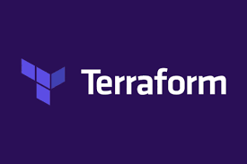
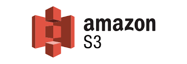
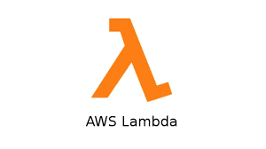
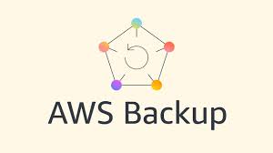

# Redução de Custos em Farmácias com AWS

Relatório e POC para demonstrar redução de custos em farmácias utilizando serviços AWS. Veja o detalhamento em `modelo-relatorio.md`.

## Finalidade do Projeto

Implementar três estratégias de otimização de custos:
- Armazenamento de longo prazo com baixo custo (S3 Glacier Deep Archive)
- Rotinas sem servidor para eliminar custos de servidores ociosos (AWS Lambda + EventBridge)
- Backup centralizado e automatizado com políticas de retenção econômicas (AWS Backup)

## Especificações (Infra como Código)

Pasta `terraform/` contém a POC em Terraform (v1.5+):
- Bucket S3 com versionamento e regra de ciclo de vida para mover objetos para DEEP_ARCHIVE após X dias
- Função AWS Lambda (Python 3.11) com agendamento diário via EventBridge
- AWS Backup: Vault, Plano diário e Seleção por tag (`Backup=Daily`)
- Variável `offline_mode` para planejamento offline sem credenciais AWS

Arquivo `modelo-relatorio.md` documenta objetivos, casos de uso e conclusões.

## Ferramentas Utilizadas

- Terraform (Infra as Code)
- AWS (S3, Lambda, EventBridge, CloudWatch Logs, AWS Backup)
- PowerShell (Windows)

Imagens:







## Passo a Passo para Verificar as Funcionalidades

Você pode validar a estrutura localmente (offline) ou, opcionalmente, em uma conta AWS.

### Modo Offline (sem conta AWS)

Requisitos: Terraform 1.5+ instalado.

```powershell
cd terraform
terraform init
terraform validate
terraform plan -refresh=false -var "offline_mode=true"
```

Observações:
- O plano é gerado localmente sem conectar à AWS (sem `apply`).
- Se houver erro de perfil AWS no seu ambiente, limpe variáveis de sessão:
```powershell
Remove-Item Env:\AWS_PROFILE -ErrorAction SilentlyContinue
Remove-Item Env:\AWS_DEFAULT_REGION -ErrorAction SilentlyContinue
```

### Modo Conectado (opcional, com conta AWS)

Requisitos: AWS CLI configurada e permissões adequadas.

```powershell
cd terraform
terraform init
terraform plan -out tfplan
terraform apply tfplan
```

Verificações no Console AWS (opcional):
- S3: bucket criado, versionamento ativo e lifecycle para DEEP_ARCHIVE
- Lambda: função implantada; regra do EventBridge agendada e logs no CloudWatch
- AWS Backup: Vault e Plano diário; adicione tag `Backup=Daily` nos recursos que deseja proteger
